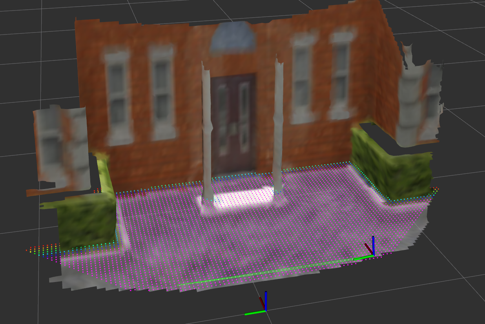
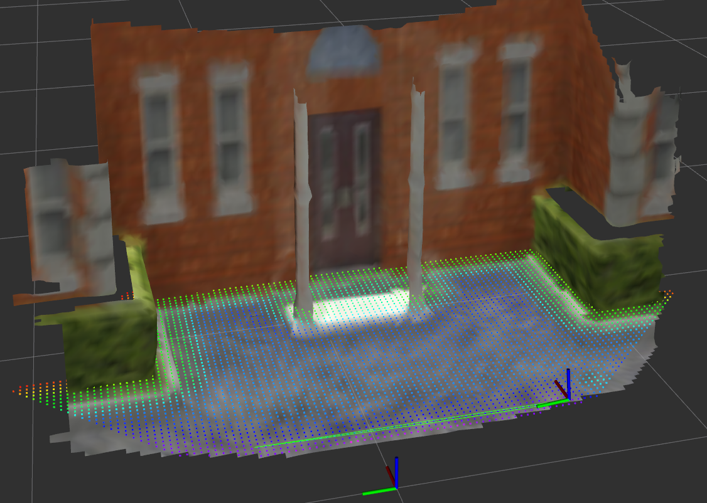

# 程序运行逻辑
1. `tsdf_server`从launch的pointcloud接收点云数据,进入 `processPointCloudMessageAndInsert`函数
2. `tsdf_integrator_->integratePointCloud`函数将点云数据插入到TSDF中

# 数据输入
- **点云数据**:可以是XYZRGB,XYZI,XYZ格式的点云数据,话题对应launch中`pointcloud`. 是采用ENU的表示法的相机坐标系下的点云位置,frame_id是自由命名,比如"point_cloud_link"
- **位姿数据**:相机的位姿,消息类型`geometry_msgs::TransformStamped`,话题对应launch中`transform`. 
是采用ENU的表示法的世界坐标系下的位姿,frame_id是和launch文件中`world_frame`保持一致,比如`world`. `child_frame_id`自由命名,比如"camera_link"

# 样例程序
- 使用Gazebo仿真,采用iris模型,加载深度和彩色摄像头,发布深度,彩色和位姿数据
- rosbag记录`/iris_0/camera/depth/image_raw`,`/iris_0/camera/color/image_raw/compressed`,`/uav0/mavros/local_position/pose`话题
- 运行深度转符合格式的点云数据,以及为点云赋彩色rgb值,转换相机位姿,并发布到`pointcloud`,`transform`话题. 程序运行
```sh
rosrun relative_pose_backend test_DepthPoseForTSDFMapInSimulator
```
- 运行voxblox, TSDF, ESDF地图构建程序
```sh
roslaunch voxblox_ros sjtu_pairs_dataset.launch
```
- 播放rosbag或者Gazebo实时发布数据,查看地图构建效果


# 重建效果展示
- Gazebo真值点云和位姿生成mesh与TSDF和ESDF

TSDF地图

  

ESDF地图

  